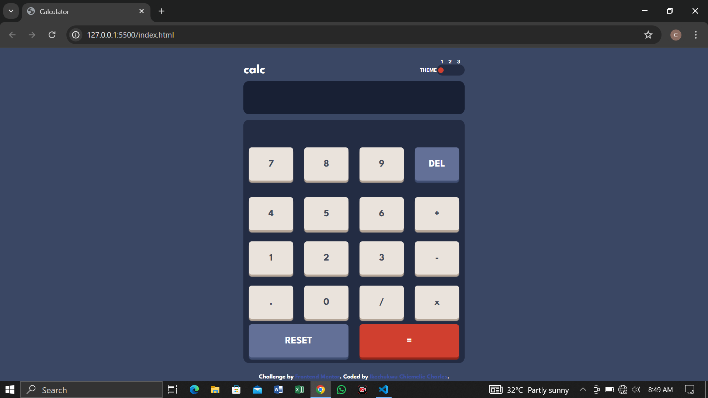

# Frontend Mentor - Calculator app solution

This is a solution to the [Calculator app challenge on Frontend Mentor](https://www.frontendmentor.io/challenges/calculator-app-9lteq5N29). Frontend Mentor challenges help you improve your coding skills by building realistic projects.

## Table of contents

- [Overview](#overview)
  - [Frontend Mentor-Calculator app solution ](#the-challenge)
  - [Screenshot](#screenshot)
  - [Links](#links)
- [My process](#my-process)
  - [Built with](#built-with)
  - [What I learned](#what-i-learned)
  - [Continued development](#continued-development)
- [Author](#author)
- [Acknowledgments](#acknowledgments)

**Note: Delete this note and update the table of contents based on what sections you keep.**

## Overview

### The challenge

Users should be able to:

- See the size of the elements adjust based on their device's screen size
- Perform mathmatical operations like addition, subtraction, multiplication, and division
- Adjust the color theme based on their preference
- **Bonus**: Have their initial theme preference checked using `prefers-color-scheme` and have any additional changes saved in the browser

### Screenshot

### Links

- Solution URL: [https://github.com/IkechukwuChiemelieCharles/calculator-theme-toggler.git](https://your-solution-url.com)
- Live Site URL: [https://calculator-theme-toggler.onrender.com/](https://calculator-theme-toggler.onrender.com/)

## My process

### Built with

- Semantic HTML5 markup
- CSS custom properties
- Flexbox
- CSS Grid
- Mobile-first workflow

- [Styled Components](https://styled-components.com/) - For styles

**Note: These are just examples. Delete this note and replace the list above with your own choices**

### What I learned

I learnt how to use css variables and improved on them

### Continued development

I want to keep improving my JavaScript Skills

## Author

- Frontend Mentor - [@IkechukwuChiemelieCharles](https://www.frontendmentor.io/profile/IkechukwuChiemelieCharles)
- Twitter - [@charlieXtopher](https://www.twitter.com/charlieXtopher)
- LinkedIn - [@chiemelieIkechukwu](https://www.linkedin.com/chiemelieIkechukwu)

## Acknowledgments

- Frontend Mentor - [@jen67](https://www.frontendmentor.io/profile/jen67)

- LinkedIn - [@Gift Amachree](https://www.linkedin.com/GiftAmachree)
